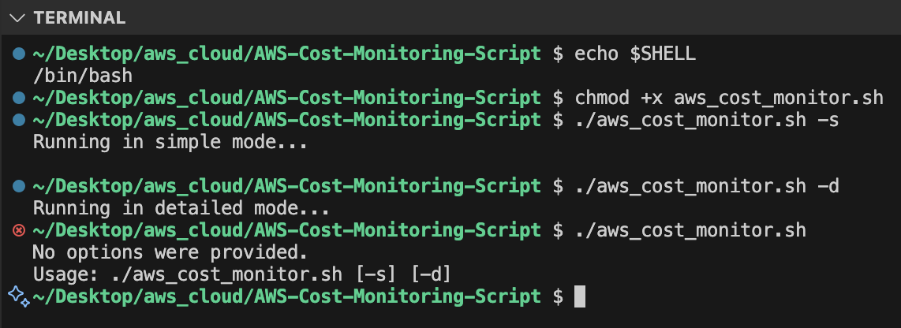

# Project Documentation: Shell Script for Cross-Platform Date Handling in AWS Cost Query

## Project Overview
This project involved creating a shell script that works cross-platform, specifically between **macOS** and **Linux/Windows** environments, to calculate date ranges. The script then uses these date ranges to query AWS Cost Explorer for monthly usage and cost data.

### Key Features:
- **Cross-Platform Compatibility**: Handles date calculations on macOS and Linux/Windows systems.
- **AWS Cost Query**: Uses the calculated dates to query AWS for cost data.
- **Automation**: Can be scheduled to run automatically for monthly cost tracking.

---

## Steps and Issues Encountered

### **1. Cross-Platform Date Calculation Issue**
One of the primary challenges was ensuring the script worked on both macOS and Linux/Windows systems. The `date` command has different syntax across these platforms:

- **macOS** uses `-v` to manipulate dates.
- **Linux/Windows (via WSL/Git Bash)** uses `-d`.

### **Solution**:
I detected the operating system and applied the correct `date` command based on the system type.

```bash
if [[ "$OSTYPE" == "darwin"* ]]; then
  # macOS-specific code
  Start=$(date -v-1d +%Y-%m-01)
  End=$(date -v-1d +%Y-%m-%d)
else
  # Linux/Windows-specific code
  Start=$(date -d "yesterday" +%Y-%m-01)
  End=$(date -d "yesterday" +%Y-%m-%d)
fi
```

---

The above code checks the operating system type using the `OSTYPE` variable and applies the correct syntax for calculating dates on macOS or Linux/Windows systems. This ensures the script works seamlessly on different platforms, allowing for accurate date range calculations.

---

### **Scenario**: Cross-Platform Date Handling

- **Objective**: Ensure the script works seamlessly on different systems.
- **Key Points**:
  - `OSTYPE` variable is used to detect the operating system.
  - The script applies the correct `date` format based on the system.

### **2. AWS Cost Query with Dynamic Date Ranges**
After determining the correct date format, the script queries AWS Cost Explorer using these dynamic date ranges.

```bash
aws ce get-cost-and-usage --time-period Start=$Start,End=$End --granularity MONTHLY --metrics "BlendedCost" --group-by Type=DIMENSION,Key=SERVICE
```

---

## Testing The Script

To ensure the functionality of the script, I performed testing on both **macOS** and **Linux** environments.

### **Test Results**:
- The script successfully retrieved the previous month's cost data in both environments.
- The dynamic date handling based on the operating system worked as expected.
- The AWS query correctly returned the monthly usage and cost data for services grouped by type.

### **Issues During Testing**:
- On **macOS**, the `date -v` command initially threw an error in some environments due to different locale settings. This was resolved by ensuring that the script was using the correct system locale.
- On **Linux/Windows**, I had to handle edge cases for the `-d` flag when the environment did not support it, which was resolved by ensuring compatibility with Git Bash and WSL.

---

## Test Output

Successful test output from the shell script after running on a macOS system.



The test result confirms that the script runs and functions as intended, providing the correct output and displaying cost data from AWS.

--- 

## Conclusion

The shell script is now cross-platform, reliable, and able to query AWS for cost data based on dynamically calculated dates. It works on macOS and Linux/Windows, ensuring consistent results regardless of the system type.

---